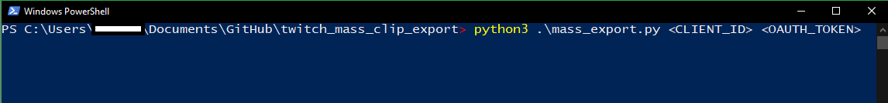
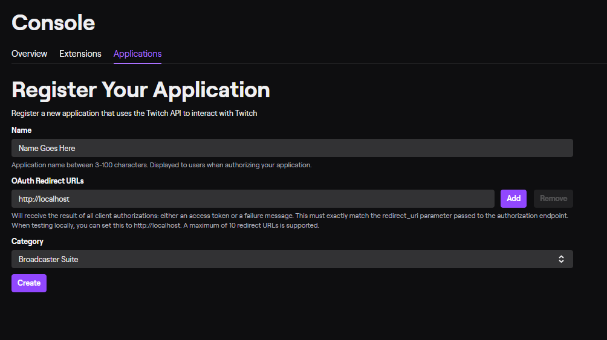
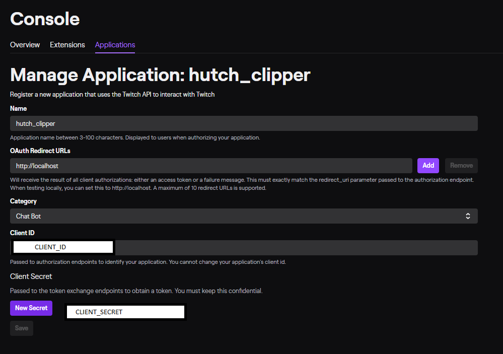
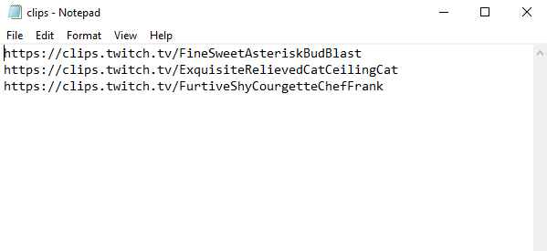

# Twitch Mass Clip Export  



This is a fork/update of amiechen's [utility](https://github.com/amiechen/twitch-batch-loader) with an OAuth utility to address the change in the Twitch API to require an access token.

## Pre-Install:

1) Get a twitch `Client ID` by registering a twitch app [here](https://dev.twitch.tv/dashboard/apps/create). You can set the redirect to `http://localhost`
Once finished, copy the `Client ID`. You will need it to run the script.
Also generate a new `Client Secret` and copy it.





2) Install python 3 on your machine if you haven't (open up Powershell if you're on windows and just type `python3`. This should take you to the Windows Store. 

3) Install the `requests` python package by going to your terminal and running 
```
pip install requests
```

## Generating OAuth Token

4) Run the included `gen_oauth_token.py` script as follows:
```
python3 gen_oauth_token.py <CLIENT_ID> <CLIENT_SECRET>
```
Replace <CLIENT_ID> and <CLIENT_SECRET> with the items you copied in step (1).

This will output an oauth access token for you to use. Copy this somewhere. You only need to generate this once.

## Mass Export Usage:


1) Delete the example clips in `clips.txt` and include the ones you want. Put each URL on it's own line. No commas or anything like that.



2) Then run the clip export script with your Client_ID and oauth access token from step (4) above.

```
cd twitch_mass_clip_export
python3 mass_export.py <CLIENT_ID> <OAUTH_ACCESS_TOKEN>
```

